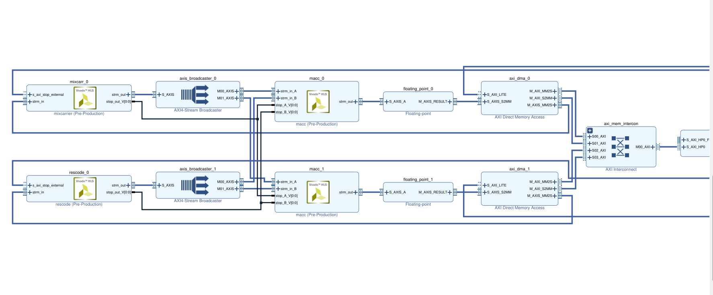

Programmable Logic

[-> Standalone Application](https://github.com/andrecc-7/GNSS-SDRLIB)

[-> Data](https://drive.google.com/drive/folders/1gXBHKwfXq1zjXu8kHz09gusBrmXr_pxb?usp=sharing)

[**Copy a Vivado block design**](https://support.xilinx.com/s/feed/0D52E00006hpJjoSAE?language=en_US)

1. current_bd_design design_1
2. write_bd_tcl -hier_blks [get_bd_cells design_1] design_1.tcl
3. **current_bd_design design_2**
4. **source design_1.tcl**

